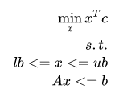
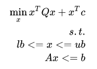

# stdgrb: Python Gurobi solvers for standard problems 

This is a fast cython wrapper for strandard dense optimization that calls 
gurobi through its C interface. It is more efficient for dense problems 
than the gurobi python 
interface that cannot accept directly numpy arrays for constraints.


## Install

The only strong dependencies are

* numpy
* cython (for the compilation)

In order to build install ```stdgrb``` you need to define first environement 
variables ```GUROBI_HOME``` and ```GUROBI_VERSION``` so that the compiler can 
find the include files and link the good library.

this can be done with 

```bash
export GUROBI_HOME=/path/to/gurobi/linux64
export GUROBI_VERSION=gurobi75 # for gurobi 7.5
``` 

you can find the gurobi version in the ```GUROBI_HOME/lib``` folder by seeking 
the ```libgurobi[XX].so``` and setting ```GUROBI_VERSION=gurobi[XX]``` 
(be carefull to remove the 'lib').

When the environement variables are set, you can install the module with

```bash
python setup.py install # --user if local install
```

## Use the module

### Linear program `lp_solve`

```python
lp_solve(c,A=None,b=None,lb=None,ub=None,nbeq=0,typevar=None, method=-1,logtoconsole=1, crossover=-1)
```

Solves the following optimization problem:



Parameters:
* c : (d,) ndarray, float64,
    Linear cost vector
* A : (n,d) ndarray, float64, optional,
    Linear constraint matrix
* b : (n,) ndarray, float64, optional,
    Linear constraint vector
* lb : (d) ndarray, float64, optional,
    Lower bound constraint
* ub : (d) ndarray, float64, optional,
    Upper bound constraint
* nbeq: int, optional,
    Treat the nbeq first lines of A as equality constraints.   
* typevar: int, (d,) ndarray, int, optional
    Integer or array of integer defining the type of variables (default 
    continuous).
    Select typevar from:
    * 0 : Continuous
    * 1 : Binary
    * 2 : Integer
    * 3 : Semi-continuous (0.0 or value in const)
    * 4 : Semi-integer (0 or value in const)       
* method : int, optional,
    Selected solver from (see gurobi documentation) 
    * -1=automatic (default), 
    * 0=primal simplex, 
    * 1=dual simplex, 
    * 2=barrier, 
    * 3=concurrent, 
    * 4=deterministic concurrent, 
    * 5=deterministic concurrent simplex
* logtoconsole : int, optional,
    If 1 the print log in console,
* crossover : int, optional,
    Select crossover strategy for interior point (see gurobi documentation)


Returns:
* x: (d,) ndarray,
    Optimal solution x
* val: float,
    Optimal value of the objective (None if optimization error)


### Quadratic program `qp_solve`

```python
qp_solve(Q,c=None,A=None,b=None,lb=None,ub=None,nbeq=0,typevar=None, method=-1,logtoconsole=1, crossover=-1)
```

Solves the following optimization problem:



Parameters:
* Q : (d,d) ndarray, float64, optional
    Quadratic cost matrix matrix
* c : (d,) ndarray, float64, optional,
    Linear cost vector
* A : (n,d) ndarray, float64, optional,
    Linear constraint matrix
* b : (n,) ndarray, float64, optional,
    Linear constraint vector
* lb : (d) ndarray, float64, optional,
    Lower bound constraint
* ub : (d) ndarray, float64, optional,
    Upper bound constraint
* nbeq: int, optional,
    Treat the nbeq first lines of A as equality constraints.    
* typevar: int, (d,) ndarray, int, optional
    Integer or array of integer defining the type of variables (default 
    continuous).
    Select typevar from:
    * 0 : Continuous
    * 1 : Binary
    * 2 : Integer
    * 3 : Semi-continuous (0.0 or value in const)
    * 4 : Semi-integer (0 or value in const)     
* method : int, optional,
    Selected solver from (see gurobi documentation) 
    * -1=automatic (default), 
    * 0=primal simplex, 
    * 1=dual simplex, 
    * 2=barrier, 
    * 3=concurrent, 
    * 4=deterministic concurrent, 
    * 5=deterministic concurrent simplex
* logtoconsole : int, optional,
    If 1 the print log in console,
* crossover : int, optional,
    Select crossover strategy for interior point (see gurobi documentation)


Returns:
* x: (d,) ndarray,
    Optimal solution x
* val: float,
    Optimal value of the objective (None if optimization error)

